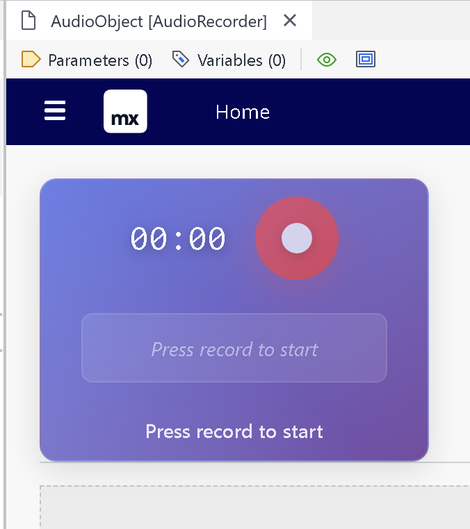
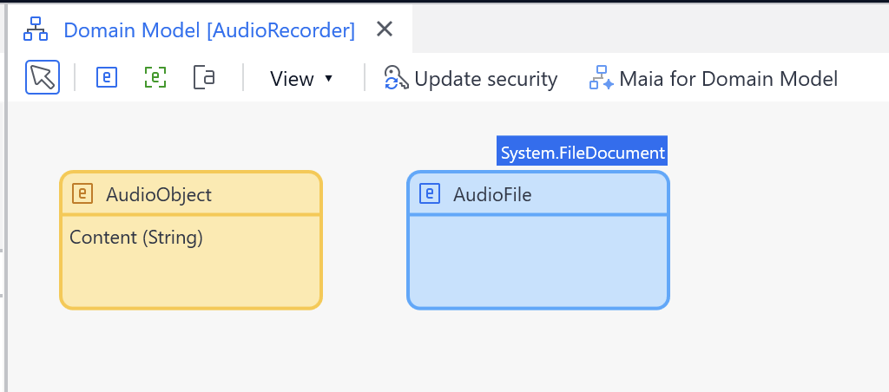
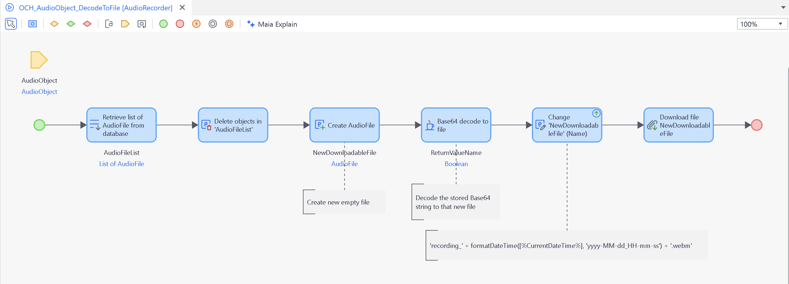

# Vibing Audio Recorder Widget

A powerful Mendix pluggable widget that enables users to record audio directly from their microphone and automatically store it as base64 data in any string attribute. Perfect for voice notes, audio feedback, documentation, and user-generated audio content.

## Features

🎤 **Direct Microphone Recording** - Record audio directly in your Mendix app using the browser's MediaRecorder API  
📝 **Base64 Conversion** - Automatically converts recorded audio to base64 format for easy storage  
💾 **Flexible Storage** - Store audio in any string attribute of your context object  
🔧 **Action Integration** - Trigger custom microflows/nanoflows after recording completes  
🎯 **Modern UI** - Beautiful gradient design with real-time waveform visualization  
⏱️ **Built-in Timer** - Shows recording duration in MM:SS format  
🌊 **Live Waveform** - Real-time audio waveform animation that responds to sound levels  
🎵 **Multiple Formats** - Choose between WebM (Opus codec) or WAV output format  
🔄 **Smart Conversion** - Always records in WebM for quality, converts to WAV when selected  
🔒 **Privacy Focused** - Properly releases microphone access after recording  
📱 **Browser Compatible** - Works with modern browsers supporting MediaRecorder API  
🔧 **Duration Fixing** - Automatically fixes WebM duration metadata using webm-duration-fix library  
⏰ **Recording Limit** - Configurable recording time limit (1-300 minutes, default: 2 hours)  
🛡️ **Security Enhanced** - Production-safe logging and error handling  
🎨 **Configurable Text** - Customize all UI text messages for different languages and use cases  
🌈 **Custom Waveform Colors** - Personalize waveform appearance with any hex color  
✨ **Vibe Coded** - This entire widget was crafted with pure vibes and good energy 🌟  

## Usage

### Basic Setup

1. **Add the widget** to any page with an object as context (e.g., Customer, Order, Document, etc.)
2. **Configure the properties**:
   - **Audio Content Attribute**: Select a string attribute where the base64 audio will be stored
   - **On Change Action**: Select a microflow/nanoflow to execute after recording
   - **Recording Settings**:
     - **Max Recording Time**: Set maximum recording duration in minutes (1-300, default: 120)
     - **Waveform Color**: Customize waveform appearance with hex color (default: #4facfe)
   - **Text Configuration**: Customize the UI text messages:
     - **Ready Text**: Text shown when ready to record (default: "Press record to start")
     - **Recording Text**: Text shown while recording (default: "Recording in progress...")
     - **Processing Text**: Text shown while processing audio (default: "Processing audio...")
     - **Completed Text**: Text shown when recording is completed (default: "Recording completed")
3. **Recording workflow**:
   - User clicks "Record" → microphone access requested and recording starts
   - User clicks "Stop Recording" → recording stops and processing begins
   - Audio is automatically converted to base64 and stored in the selected attribute
   - OnChange action is triggered if configured
   - Microphone access is properly released

### Processing Audio Data

After recording, you can access the base64 audio data in your microflow and convert it to a file:

#### Required Module
First, download and import the **CommunityCommons** module from the Mendix Marketplace, which provides the necessary file conversion actions.

#### Example Domain Model 

#### Example Microflow 

1. **Create a FileDocument object**
   - Return: `$AudioFile`

2. **Call CommunityCommons.Base64DecodeToFile**
   - Parameter 1: `$AudioObject/AudioBase64`
   - Parameter 2: `$AudioFile`
   - Return: `Boolean`

3. **Change Object** (set file properties)
   - Object: `$AudioFile`
   - Set `Name` to: `recording_' + formatDateTime([%CurrentDateTime%], 'yyyy-MM-dd_HH-mm-ss') + '.webm'` (or `.wav` if WAV format selected)
   - Set other properties as needed

5. **Commit Object**
   - Object: `$AudioFile`

6. **Further Processing** (optional)
   - Download file, send via email, store in cloud, etc.

## Demo Project

🌐 **Live Demo**: Try the widget in action at [https://vibingaudiorecorderdemo-sandbox.mxapps.io/](https://vibingaudiorecorderdemo-sandbox.mxapps.io/)

## Technical Details

- **Audio Format**: WebM with Opus codec
- **Storage Format**: Base64 string
- **File Extension**: `.webm` (must be set manually when creating FileDocument)
- **File Size**: ~1KB per second (compressed)
- **Maximum Recording Time**: Configurable limit (1-300 minutes, default: 120 minutes)
- **Browser Support**: Chrome, Firefox, Safari, Edge (modern versions with MediaRecorder API)
- **Format Compatibility**: Excellent compression with good browser support
- **Permissions**: Requires user consent for microphone access
- **Dependencies**: 
  - webm-duration-fix library for proper audio duration metadata
- **Security**: Production-safe logging and automatic recording limits

## Browser Compatibility

| Browser | Support | Notes |
|---------|---------|--------|
| Chrome | ✅ Full | Best performance |
| Firefox | ✅ Full | Good performance |
| Safari | ✅ Limited | iOS 14.3+ required |
| Edge | ✅ Full | Chromium-based versions |

## Security Features

🛡️ **Configurable Recording Limits** - Set custom maximum recording time (1-300 minutes) to prevent excessive memory usage  
🔒 **Production-Safe Logging** - Debug logs only appear in development environments  
🧹 **Memory Management** - Proper cleanup of audio contexts, media streams, and event listeners  
🎯 **Input Validation** - Validates audio blobs and handles errors gracefully 

## Issues, Suggestions and Feature Requests

Found a bug or have a feature request? Please create an issue on our [GitHub Issues page](https://github.com/jopterhorst/vibingaudiorecorder/issues).

## Development and Contribution

### Prerequisites
- Node.js (v16 or higher)
- Mendix Studio Pro
- Git

### Setup
1. Clone the repository: `git clone https://github.com/jopterhorst/vibingaudiorecorder.git`
2. Install dependencies: `npm install`
3. Start development: `npm start` - automatically builds and deploys to test project

### Building
- **Development**: `npm start` - watches for changes and auto-builds
- **Production**: `npm run build` - creates optimized .mpk file in `/dist` folder

### Dependencies
The widget uses the following key dependencies:
- `webm-duration-fix` - Fixes WebM audio duration metadata
- `audiobuffer-to-wav` - Converts WebM audio to WAV format
- `classnames` - Utility for conditional CSS classes
- `@mendix/pluggable-widgets-tools` - Mendix widget development tools

### Contributing
We welcome contributions! Please:
1. Fork the repository
2. Create a feature branch: `git checkout -b feature/amazing-feature`
3. Commit your changes: `git commit -m 'Add amazing feature'`
4. Push to the branch: `git push origin feature/amazing-feature`
5. Open a Pull Request

## License

This project is licensed under the MIT License - see the [LICENSE](LICENSE) file for details.

## Version History

- **v1.0.0** - Comprehensive audio recorder with configurable features
  - � **Core**: Direct microphone recording with WebM format and Opus codec
  - � **Customization**: Configurable UI text and waveform colors
  - ⏰ **Flexibility**: Configurable recording time limits (1-300 minutes)
  - 🌊 **Visualization**: Real-time waveform animation with custom colors
  - �️ **Security**: Production-safe logging and automatic recording limits
  - 🔧 **Integration**: Base64 storage with onChange action support
  - 📦 **Dependencies**: Enhanced with webm-duration-fix and security updates

---

Made with ❤️ for the Mendix Community
